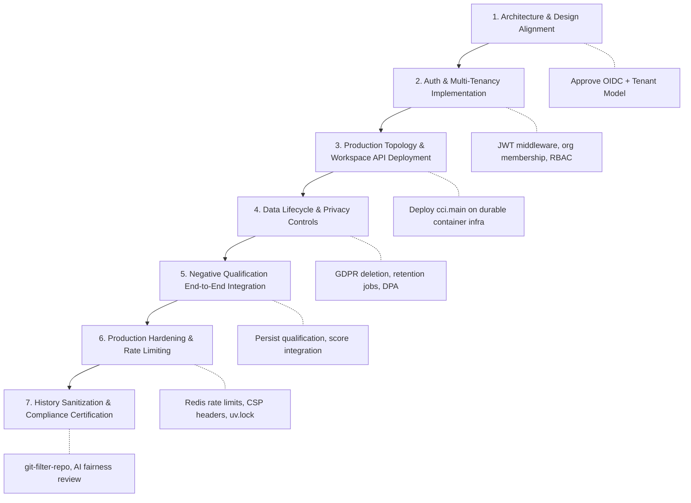

# CandidateX SaaS commercial readiness audit

**Review date:** 2026-09-24
**Reviewed branch:** `codex/candidatex-saas-readiness`
**Reviewed code snapshot:** `a07c7bf` (commit `a07c7bf873c52e468db963503b12ce056637ef81`), containing backend-hardening cherry-pick `8676bf6` ("evaluate bounded negative candidates") and privacy sanitization commit `a07c7bf`; based on `origin/main` ancestor `baa559f`
**Remote branch heads verified via `git ls-remote`:**
- `origin/main`: `50556ac936fb346a59e6049453f6ab7d22832f8b`
- `origin/codex/backend-hardening`: `891865dea84368fa0a60005165b8fddf70c85bf2`
- `origin/codex/candidatex-evidence-os`: `2dce46cde56211bd688659fa9505f66209b4561c`
- `origin/codex/candidatex-commercial-audit`: `ccc8ad3cfc64cd8b79eef5e02dae5b8996c7e373`
- `origin/codex/candidatex-saas-readiness`: `a07c7bf873c52e468db963503b12ce056637ef81` (synchronized and pushed)
**Verdict:** Not ready for a commercial multi-tenant launch or customer applicant data.

---

## Scope

This review covers the combined backend-hardening and Evidence OS branches, API routes, persistence layers, deployment entrypoints, demo and seed fixtures, security postures, and automated regression test suites. I inspected the current `origin/main` head, divergence across active development branches, and the latest remote heads. The running production deployment environment was not confirmed, so this review does not certify live cloud infrastructure.

---

## Branch Currency and Divergence

The audit branch `codex/candidatex-saas-readiness` incorporates:
1. Commit `8676bf6` (cherry-picked from `origin/codex/backend-hardening` commit `4eed784`), which adds bounded negative candidate evaluation (`services/backend/src/cci/contradictions/candidates.py`) and 46 automated unit tests.
2. Commit `a07c7bf` (`fix(privacy): sanitize demo identities, sample resumes, and database seeds`), which cleanses all working-tree fixtures, database seeds, and UI mocks, and adds automated privacy regression tests in both backend and web suites.

### Upstream Heads and Divergence
- **`origin/main` (50556ac):** Advanced ahead of ancestor `baa559f` with PR #22 and commit `2a98033` (hardening local development defaults: `DEBUG=false`, required database password, loopback-only bindings). Those changes are not present in this candidate branch. A prior merge attempt encountered widespread conflicts across documentation, layout, and lockfiles and was safely aborted. This branch must not be assumed to be the release branch or merged into `main` blindly.
- **`origin/codex/backend-hardening` (891865d):** Has advanced past `4eed784` with commit `891865d` ("fix(contradictions): enforce strict candidate validation and normalization"), adding Go module direct require validation and deployment project identity normalization.
- **Shared local checkout:** The separate shared checkout at `C:\Users\yoray\Downloads\CandidateX-main\CandidateX-main` remains untouched at `aebee8e` with user changes, preserving isolation from this audit worktree.

---

## Verification Completed on Exact Current Snapshot (`a07c7bf`)

All verification steps were executed serially on the working copy to ensure consistent build artifacts:

1. **`git diff --check`:** PASSED cleanly with 0 whitespace or formatting errors.
2. **Backend test suite (`python -m pytest -q` from `services/backend`):**
   - **539 passed, 0 skipped, 0 failed, 5 warnings** (Starlette/HTTPX and Alembic path deprecations).
   - Includes 46 passed tests in `tests/unit/contradictions/test_candidates.py` and 2 passed tests in `tests/test_demo_data_privacy.py`.
   - The previously skipped test in `tests/unit/test_signal_rule_catalog.py:153` is now active and passing with the contradiction evaluator present.
3. **Frontend typecheck and lint (`pnpm --filter web lint` / `tsc --noEmit`):**
   - **PASSED with 0 errors**.
4. **Next.js production build (`pnpm --filter web build`):**
   - **PASSED with 0 errors**. All 9 routes compiled and statically prerendered or flagged dynamic on demand without issues.
5. **Full web Playwright test suite (`pnpm exec playwright test` in `apps/web`):**
   - **25 of 25 passed across all 6 spec files in 2.2 minutes**.
   - Verified tests:
     - `demo-privacy.spec.ts` (2 tests: hiring dashboard synthetic fallback and candidate intake presets)
     - `evidence-os.spec.ts` (1 test: landing page routing)
     - `live-analysis-ui.spec.ts` (12 tests: extraction, manifests, audit rail, 3D graph, WebGL fallback)
     - `live-analysis.spec.ts` (4 tests: API uploads, DOCX parsing, mobile viewport, export)
     - `live-dossier.spec.ts` (2 tests: partial dossier provenance, 20k-character JD boundary)
     - `research-demo.spec.ts` (4 tests: live paper demonstration, mobile controls, override handling)

---

## Launch Blockers

### 1. Critical: No authenticated user or server-verified tenant boundary
The FastAPI application (`services/backend/src/cci/main.py`) contains no authentication dependencies or authorization middleware.
- Listing endpoints (`/api/v1/candidates`, `/api/v1/jobs`) accept caller-supplied `organization_id` parameters without verification. If omitted, `/api/v1/candidates` returns records across all organizations.
- Detail, dossier, evidence graph, provenance, and audit endpoints accept arbitrary UUIDs without verifying tenant membership.
- Recruiter override requests (`/api/v1/overrides`) accept caller-supplied `user_id` and optional `organization_id`.
- Dossier and evidence graph routers (`dossier.py`) maintain process-global in-memory dictionaries (`_DOSSIER_STORE`, `_GRAPH_STORE`), and the override router maintains a global `_AUDIT_LOG_STORE`. Multi-worker or multi-container deployments will exhibit state desynchronization.
- The database schema (`Organization`, `User`) lacks an organization-membership join table or role-based access control (RBAC) model.
- **Design Status:** The proposed architecture of provider-neutral managed OIDC (e.g. Auth0 / Okta / Cognito) coupled with application-owned organizations and membership remains an **unanswered design question**. All auth-dependent implementation remains blocked pending explicit user/stakeholder approval.
- **Impact:** An employer's applicant pool, candidate evaluations, and override logs would be accessible to any other party on the platform.

### 2. Critical: The deployed backend entrypoint does not serve the company workspace API
The serverless deployment entrypoint at `services/backend/app.py` directly imports `cci.live_app`:
```python
from cci.live_app import app
```
`cci.live_app` mounts only `live_router` (request-scoped, stateless document analysis) and `research_demo_router` (synthetic ablation demonstrations). It intentionally omits `candidates`, `jobs`, `dossier`, `pipeline`, and `overrides` routers.
- The deployed public Vercel frontend provides `/hr` and `/workspace` views, but there is no deployed persistent API backing those routes.
- The live evaluation pipeline explicitly specifies `storage: request_only` and avoids database retention.
- **Impact:** The running deployment is a stateless demo surface, not a commercial enterprise SaaS product. A unified production topology (e.g., containerized ECS/EKS/Cloud Run cluster with managed Postgres and background worker queues) must be selected, configured, and verified.

### 3. Critical: No demonstrated hiring validity or algorithmic fairness evidence
All static scoring signals are documented in code as uncalibrated policy heuristics.
- The repository contains no independent job-related validity studies (Uniform Guidelines on Employee Selection Procedures, EEOC), no adverse-impact analyses (four-fifths rule), and no demographic calibration.
- Under the EU AI Act (Regulation (EU) 2024/1689), AI systems intended for recruitment or selection, notably for screening or filtering applications, are classified as **High-Risk AI Systems** (Annex III, point 4(a)). Requirements include continuous risk management, data governance, technical documentation, record-keeping, human oversight, accuracy, and cybersecurity.
- **Impact:** Selling or marketing the platform as an automated candidate screening or rejection engine creates immediate legal and regulatory exposure for enterprise customers. Scoring must remain strictly advisory decision-support under human supervision until formal validation studies are conducted.

### 4. High: Candidate-data lifecycle, retention, and deletion are absent
While `cci.live_app` avoids retention by design, the core database schema in `cci.main` stores applicant manifests, resumes, and dossier records indefinitely without lifecycle management.
- There are no customer-facing or automated APIs for candidate record deletion, retention limits, right-to-be-forgotten propagation (GDPR Art. 17 / CCPA), or audit log purge policies.
- No Data Processing Agreement (DPA), subprocessor list, or controller/processor definition exists for commercial enterprise customers.
- **Impact:** Enterprise HR and compliance teams cannot legally deploy the platform with real applicant resumes without certified data lifecycle and deletion guarantees.

### 5. High: Negative-evidence qualification is not enforced end to end
Commit `8676bf6` introduced `cci/contradictions/candidates.py` to evaluate bounded negative candidates across registered claim types, and upstream `backend-hardening` commit `891865d` added stricter module and deployment validation. However:
- End-to-end qualification is not integrated across database persistence, scoring, graph building, and APIs.
- The database `Evidence` model does not store typed `NegativeEvidenceDetails` or scan completeness records.
- Downstream scoring and corroboration algorithms continue to branch primarily on boolean `is_positive_support` flags, potentially consuming unqualified negatives.
- **Impact:** Contradiction findings and negative assertions cannot be safely relied upon in hiring recommendations without end-to-end qualification guarantees.

### 6. High: Public Git history exposes prior personal identities (Release Caveat)
While the active working tree is fully sanitized as of commit `a07c7bf`, earlier commits in the public Git history on `main` and feature branches contain real candidate names, student email addresses, and personal GitHub URLs.
- **Release Caveat:** Sanitizing the working copy prevents new exposures, but public cloning or auditing of the repository history will still reveal historical personal data unless the history is cleaned.
- **Remediation Path:** Public history rewriting must not be performed without explicit stakeholder authorization. Once approved, the required remediation path is:
  1. Execute `git-filter-repo` using a replacement map to rewrite historical commits across all branches.
  2. Coordinate forced updates across remote mirrors and forks.
  3. Ensure contributors re-clone or rebase their local worktrees.

### 7. High: Public analysis compute lacks per-tenant quotas and rate limiting
Public routes (`/api/live/*` and Next.js proxy endpoints) parse complex documents (PDFs, DOCX, ZIP archives) and fetch external URLs (GitHub repositories, public web pages).
- There is no application-level rate limiting (e.g., token bucket via Redis), per-IP throttling, or concurrency gate in FastAPI or Next.js route handlers.
- Malicious or automated requests can induce denial-of-service, CPU exhaustion, or SSRF-related egress spikes.
- **Impact:** Unbounded resource consumption and potential denial-of-service vulnerabilities.

### 8. High: Missing reproducible Python lockfile and supply-chain scanning
- While the frontend relies on `pnpm-lock.yaml`, the backend `pyproject.toml` uses loose minimum-version bounds (e.g., `fastapi>=0.115.0`) without a locked dependency graph (such as `requirements.lock` or `uv.lock`).
- CI currently runs linting and testing but lacks automated dependency vulnerability scanning (e.g., `pip-audit`, Trivy, or Snyk) for Python packages.
- **Impact:** Non-deterministic container builds and unmonitored upstream vulnerabilities.

---

## Recommended Launch Roadmap



1. **Resolve Architecture Decisions:**
   - Formalize and approve the authentication and tenant model (managed OIDC + application-owned organizations).
2. **Implement Authentication & Tenant Isolation:**
   - Introduce JWT verification middleware, organization membership join tables, and request-scoped DB tenancy filters. Replace all in-memory global caches (`_DOSSIER_STORE`, `_GRAPH_STORE`, `_AUDIT_LOG_STORE`) with tenant-scoped Redis/Postgres storage.
3. **Deploy Unified Workspace Topology:**
   - Migrate beyond Vercel serverless for the full product; deploy containerized `cci.main` alongside Next.js with persistent Postgres and async workers (Celery/Temporal).
4. **Implement Data Lifecycle & Privacy Policies:**
   - Build candidate deletion endpoints with cascade cleanup, implement automated retention purge tasks, and publish enterprise privacy policies.
5. **Complete Negative Evidence Qualification:**
   - Incorporate `891865d` candidate validation fixes, persist `NegativeEvidenceDetails` in the DB schema, and ensure scoring algorithms reject unqualified negatives.
6. **Harden Edge Security & Supply Chain:**
   - Implement Redis-backed rate limiting, enforce Content Security Policy (CSP) and strict CORS, generate a pinned Python lockfile (`uv.lock`), and integrate `pip-audit` into CI.
7. **Address Historical Git Exposure:**
   - With explicit stakeholder sign-off, execute `git-filter-repo` to sanitize historical commits before public enterprise marketing.

---

## Release Recommendation

**Do not release CandidateX as a commercial enterprise SaaS product in its current state.**

The working-copy privacy sanitization (`a07c7bf`) and unit/E2E test suites (539 pytest cases, 25 Playwright tests) establish a solid and verifiable baseline. However, without authentication, tenant isolation, a deployed company workspace API, candidate deletion mechanisms, rate limiting, and employment-fairness compliance, the system remains a supervised technical demonstration rather than an enterprise-ready commercial SaaS offering.
